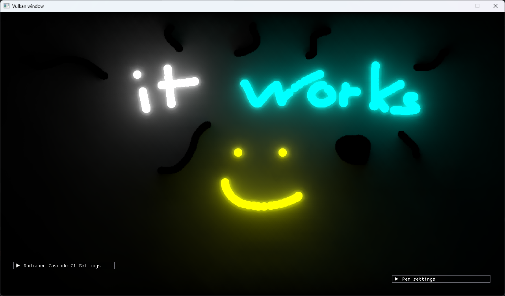
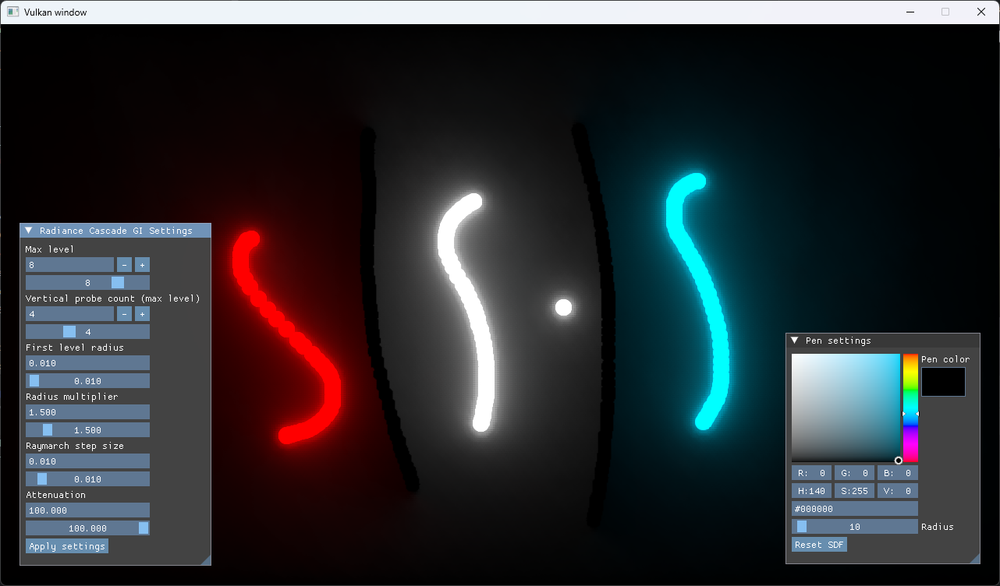

# RadianceCascadeGIVulkan

[Blog post](https://tlegoc.github.io/blogs/radiance-cascade/)

Vulkan implementation of radiance cascades for global illumination. 
https://www.youtube.com/watch?v=lpKE0YDOlZA

# TODO

- Lower vulkan minimum capabilities (especially shader constant size 8 and 16, as it seems it is not supported by many gpus)
- Fix radiance cascade merging which is probably the cause for weird checkerboard pattern (more noticeable on lower cascade resolution)
- Code cleanup

# References

- [tmpvar : https://tmpvar.com/poc/radiance-cascades/](https://tmpvar.com/poc/radiance-cascades/)
- [Alexander Sannikov's Exilecon talk](https://www.youtube.com/watch?v=TrHHTQqmAaM&t=1612s)
- [SimonDev's implementation](https://github.com/simondevyoutube/Shaders_RadianceCascades)
